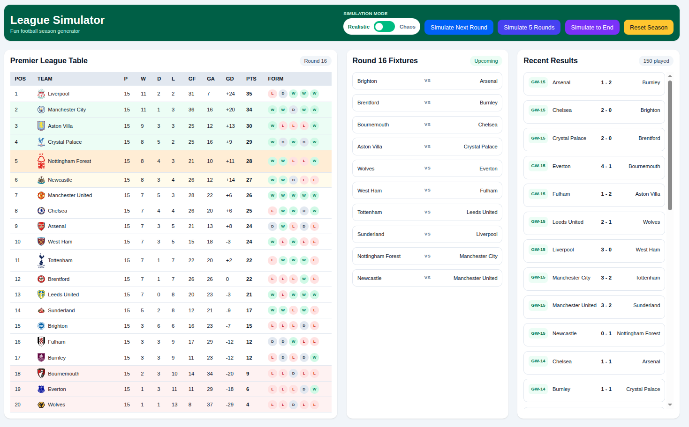
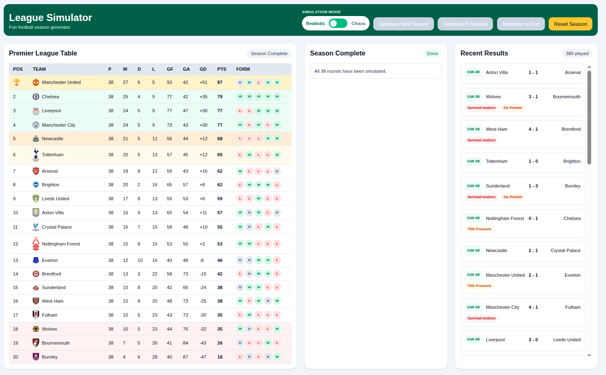
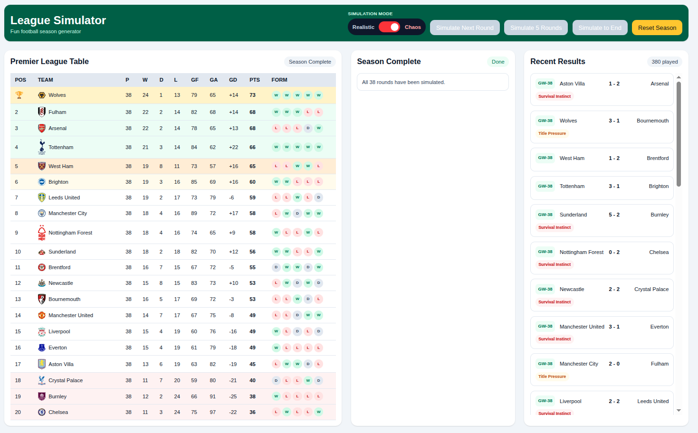

# League Simulator ⚽

A realistic football league simulation engine built with **Next.js**, designed to simulate full league seasons with dynamic match outcomes, team strengths, form influence, and late-season pressure mechanics.

The simulator allows users to run entire seasons instantly and observe how league tables evolve under two different simulation modes.

🌐 **Live Demo**
https://league-simulator.shantharam.dev

---

# Overview

League Simulator models a full **38-gameweek football season** with realistic match outcomes influenced by multiple factors including:

- Team attacking, midfield and defensive strength
- Recent form
- Home advantage
- Late-season title pressure
- Relegation survival instincts
- Random variance

The goal is to produce league tables that resemble real football seasons while still allowing for occasional surprises.

---

# Screenshots

## League Table (In Progress)

  

---

## Realistic Mode

In realistic mode, match results are influenced by team ratings, form, and tactical matchups.
Strong teams tend to perform consistently while still allowing for occasional upsets.

  

---

## Chaos Mode

Chaos mode significantly increases randomness in match outcomes.
Underdogs can win leagues, huge scorelines can occur, and traditional strength hierarchies are weakened.

  

---

# Simulation Engine

Each match is simulated using a custom algorithm that considers several football-specific factors.

### Team Strength Model

Each club has four core attributes:

OVR - Overall rating
ATT - Attack strength
MID - Midfield control
DEF - Defensive strength

Matchups consider attack vs defense and midfield dominance to generate expected goal values.

---

### Home Advantage

Home teams receive a small statistical advantage to reflect real football conditions.

---

### Recent Form

The last five matches influence performance.

Example form indicator: W W D W L

Teams on strong winning runs gain a performance boost.

---

### Late Season Dynamics

From around **Gameweek 30 onward**, additional modifiers activate:

**Title Pressure**

Top teams competing for the title may suffer slight performance volatility.

**Survival Instinct**

Teams fighting relegation gain small boosts in performance intensity.

---

### Rare Legendary Results

To reflect football unpredictability, extremely rare scorelines can occur such as 7-0, 5-6, 9-0 etc...

These are intentionally extremely unlikely but possible.

---

# League Structure

The simulator models a typical top-flight football league:

- **20 Teams**
- **38 Gameweeks**
- **Home & Away Fixtures**

Table positions include visual indicators for:

| Position | Meaning |
|--------|--------|
| 🏆 | Champion |
| Green | Champions League |
| Orange | Europa League |
| Amber | Conference League |
| Red | Relegation |

---

# Technology Stack

Frontend Framework
- **Next.js 16**

Language
- **TypeScript**

Styling
- **TailwindCSS**

Deployment
- **Railway**

DNS & CDN
- **Cloudflare**

---

# Running Locally

Clone the repository

`git clone https://github.com/<your-username>/league-simulator.git`

Install Dependencies

`npm install`

Start Dev Server

`npm run dev`

Open in Browser

`http://localhost:3000`

---

# Changelog

## v0.2.0

- 📊 **LS009 - Club Results View** - Drill into any team’s full season with smart filters and visual match outcomes
- 🌍 **LS010 - IRL Snapshot Mode** - Start simulations from real-world standings with actual fixtures and results
- ⚙️ **UX & Logic Enhancements** - Improved sorting, state handling, and layout responsiveness

---
# Future Improvements

Planned enhancements include:

~~ LS009 : Club Results Modal with filtering by Wins, Losses, Draws, Home and Away results ~~
~~ LS010 : Simulation for remaining fixtures based on Real world fixtures and table as of 17th March 2026 ~~
LS011 - League Insights Panel
LS012 - Match Simulation Animation
LS013 - Splash Screen with options to select Leagues
LS014 - Championship & EFL League One (Only for fresh start not IRL)
LS016 - Smarter Chaos mode
LS017 - Timeline View (Season Story)
LS017 - Club Profile Page (view form graph, results timeline, position over the season)
LS018 - Save & Load Season
LS019 - Share to Facebook/Instagram
LS020 - WHAT IF!! Mode - Edit results manually.. lol!!!
LS021 - Scenario Presets (Arsenal Bottle Job, Relegation to Champions League etc.. )
LS022 - UI Micro Enhancements

---

# Author

Shantharam Shenoy K

Portfolio
https://shantharam.dev

Live Project
https://league-simulator.shantharam.dev

---

# License

This project is intended for educational and demonstration purposes.
